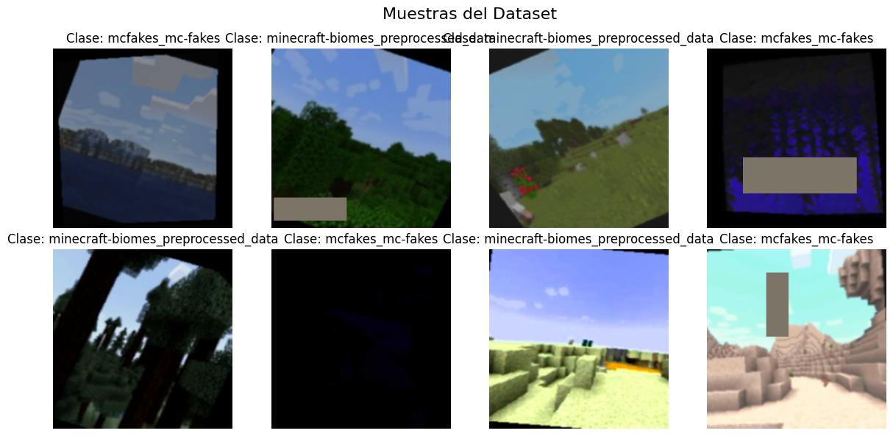
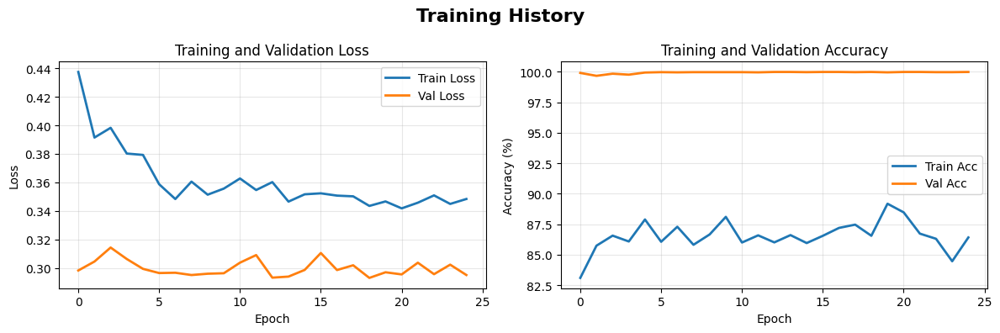
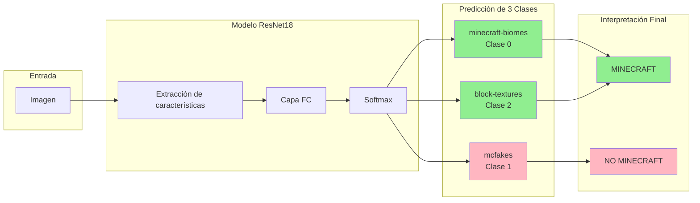
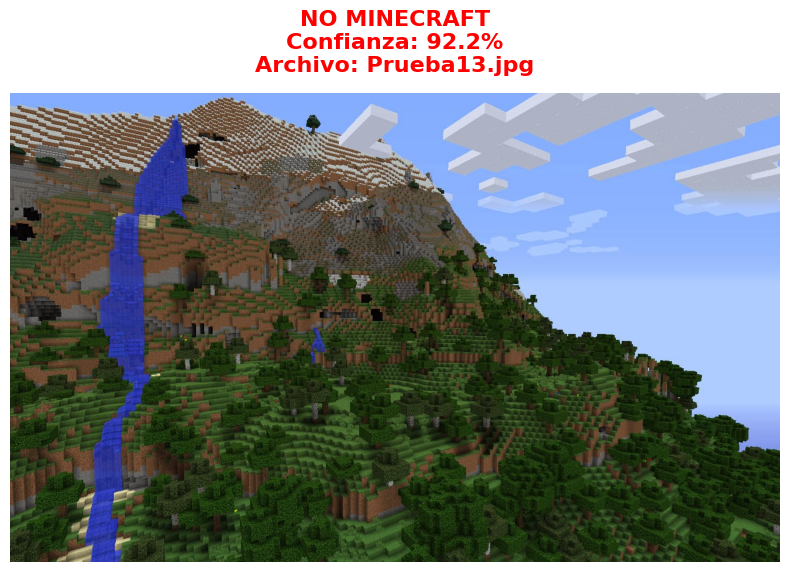
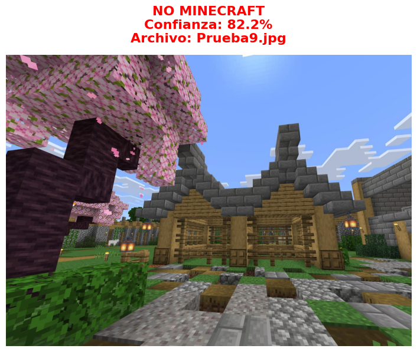
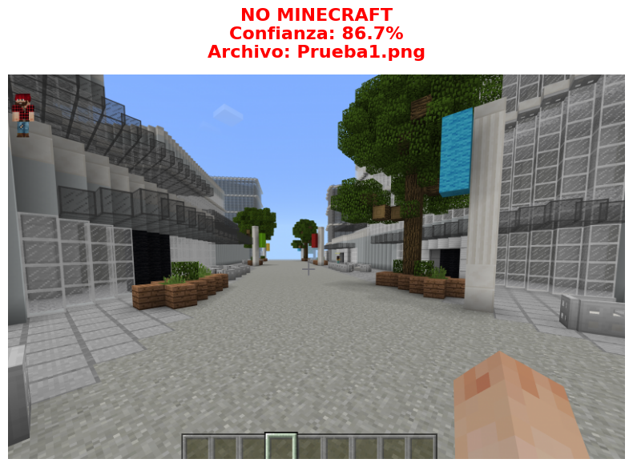

<div style="text-align: center; padding: 40px;">
  <h1 style="color: #003366; font-size: 2.5em;">
    Clasificador de Imágenes de Minecraft
  </h1>
  
  <p style="font-size: 1.2em; color: #666;">
    Implementación de Redes Neuronales Convolucionales<br>
    con Transfer Learning y Técnicas de Regularización
  </p>
  
  <hr style="margin: 30px 0;">
  
  <h2>Módulo 2: Técnicas y Arquitecturas de Deep Learning</h2>
  
  <p>Tecnológico de Monterrey</p>  
  <p><strong>Autor:</strong> Mauricio</p>
  <p><strong>Noviembre 2025</strong></p>
</div>

---

## 1. Introducción

En este proyecto lo que implemente es una red neuronal de tipo CNN para la clasificar si una imagen corresponde al juego de Minecraft, utilizando técnicas de Deep Learning. El objetivo que busco es que mi modelo sea capaz de distinguir entre diferentes archivos de contenido visual si estos pertenecen o no. 

Para lograr esto, implementé Transfer Learning con la arquitectura ResNet18 preentrenada en ImageNet, junto con técnicas de regularización para optimizar el rendimiento y la capacidad de generalización del modelo. El desarrollo se realizó en PyTorch con aceleración por GPU mediante CUDA esto debido a que mi computadora cuenta con esta facilidad.

---

## 2. Datasets Utilizados

Los datos con los que se construyo este modelo fueron 3 datasets encontrados en Kaggle, estos aportaban caracteristicas visuales únicas que aportaban diversidad al entrenamiento haciéndolo más robusto.

### 2.1 Dataset 1: MC-Fakes (jeffheaton/mcfakes)

Este dataset contiene aproximadamente 60,000 imágenes divididas entre capturas de pantalla reales de Minecraft e imágenes generadas artificialmente intentando imitar el estilo visual del juego. El uso de este dataset es fundamental para el modelo debido a la detección de contenido auténtico versus sintético.

Las imágenes presentan variedad en resolución y composición, incluyendo paisajes, estructuras y escenas. Este dataset aporta la capacidad de discriminación entre contenido genuino y falsificaciones.

### 2.2 Dataset 2: Minecraft Block Textures (urvishahir/minecraft-block-textures-dataset)

Contiene aproximadamente 4,000 imágenes de texturas individuales de bloques del juego. Cada imagen muestra la textura de un tipo específico de bloque (tierra, piedra, madera, minerales, etc.) en formato cuadrado y con fondo uniforme.

Este dataset es útil porque:

- Presenta patrones visuales muy definidos y consistentes
- Las texturas tienen características pixeladas distintivas del estilo artístico de Minecraft
- Permite al modelo aprender los elementos visuales fundamentales que componen el mundo del juego

### 2.3 Dataset 3: Minecraft Biomes (willowc/minecraft-biomes)

Aporta aproximadamente 4,000 capturas de pantalla de diferentes biomas del juego: desiertos, bosques, océanos, montañas nevadas, junglas, entre otros. Las imágenes muestran escenas completas del mundo de Minecraft con múltiples elementos visuales interactuando.

La importancia de este dataset radica en:

- Proporciona contexto espacial y composición de escenas completas
- Muestra la interacción de múltiples texturas y elementos en un mismo frame
- Representa el contenido visual que un jugador típicamente observa durante el gameplay

### 2.4 Justificación de la Combinación

Tomé la decisión de combinar estos tres datasets debido a la necesidad de crear un clasificador robusto que comprenda diferentes niveles de abstracción visual del universo Minecraft:

| Dataset | Nivel de Abstracción | Aporte Principal |
|---------|---------------------|------------------|
| Block Textures | Bajo (elementos individuales) | Patrones fundamentales y estilo pixelado |
| Biomes | Alto (escenas completas) | Composición espacial y contexto |
| MC-Fakes | Variable | Discriminación real vs. sintético |

Esta combinación permite que el modelo aprenda tanto las características micro (texturas individuales) como macro (escenas completas) del contenido visual de Minecraft, además de desarrollar capacidad crítica para identificar contenido no auténtico.

### 2.5 Estadísticas del Dataset resultante con los 3 combinados
|Métrica| Valor|
|-------|------|
|Total de imagenes disponibles | \(\approx \) 68,415|
|Imágenes utilizadas (90%) | 42,131 |
|Conjunto de entrenamiento (70%) | 29,491 |
|Conjunto de validación (15%) | 6,319 |
|Conjunto de prueba (15%) | 6,321 |
|Número de clases | 3 |

### Muestra del Dataset 

<div align="center">
    
    <br>
    <em>Figura 1: Muestra del Dataset</em>
</div>

---

## 3. Primer modelo realizado y descartado: CNN desde Cero (TensorFlow/Keras)

### 3.1 Enfoque 
El primer modelo que realicé fue utilizando Tensorflow 2 y Keras, siguiendo los ejemplos que vimos durante el semestre. El objetivo que tenía con este era establecer un punto de referencia en esta no utilicé transfer learning, para después tener un diferente enfoque con el modelo actual.

### 3.2 Arquitectura del modelo
La arquitectura implementada sigue un patrón clásico de CNN con capas convolocionales progresivamente más profundas.

|Capa|Configuración|Parámetros|
|-|-|-|
|Conv2D + MaxPool | 32 filtros, 3x3, ReLU|896|
|Conv2D + MaxPool | 64 filtros, 3x3, ReLU|18,496|
|Conv2D + MaxPool | 128 filtros, 3x3, ReLU|73,856|
|Flatten + Dropout | Dropout 50% |0|
|Dense + Dropout | 512 neuronas, ReLU, Dropout 50% |9,437,696|
|Dense (Salida)|1 neurona, Sigmoid| 513|
|Total| | 9,679,041|

### 3.3 Configuración de Entrenamiento
El modelo se entrenó con la siguiente configuración
- **Optimizador:** Adam con learning rate inicial de 0.001
- **Función de perdida:** Binary Crossentropy (Clasificación binaria)
- **Epochs máximas:** 20 con early stopping (patiance=5)
- **Batch size:** 32
- **GPU:** Tesla P100-PCIE-16GB (Kaggle)
- **Data Augmentation:** Rotación ($\pm$ 20$^\circ$), desplazamiento (20%), flip horizontal, zoom (20%), shear (20%)
- **ReduceLROnPlateau:** Factor 0.2, patience 3, min_lr 0.00001

### 3.4 Resultados del Primer Modelo
Después de 9 épocas de entrenamiento de este primero modelo se alcanzó una precisión de validación del 74% con un loss de validación del 0.4953. El entrenamiento se detuvo gracias al early stopping debido al estancamiento en la mejora de las métricas. 

Este resultado aunque fue funcional, dio como evidencia las limitaciones de entrenar una CNN desde 0 con un dataset de tamaño moderado. La falta de conocimiento previo sobre características visuales generales obligaba al modelo a aprender todo desde 0, resultando en una convergencia lenta y precisión limitada. 

---

## 4. Segundo Modelo: Transfer Learning con ResNet18 (PyTorch)

### 4.1 Cambio de estrategia 

Después de ver algunas de las limitaciones que tenía el proyecto anterior, decidí optar por una estrategia utilizando Transfer Learning haciendo uso de PyTorch como framework, escogí este por la flexiblidad para personalizar las arquitecturas, además de que tiene una compatibilidad con la GPU de mi computadora que es NVIDIA. 

Adicionalmente incrementé el uso del dataset de un 50% a un 90% del total disponible, proporcionando mayor cantidad de datos para el entrenamiento y mejorando así la capacidad de generalización del modelo.

### 4.2 Justificación del uso de ResNet18

Seleccioné ResNet18 como arquitectura debido a:
- Cuenta con 11.3 millones de parametros, es significantemente más ligero que ResNet50 que cuenta con 25M o ResNet101 que cuenta con 44M haciendo que este modelo cuente con un entrenamiento más rápido. 
- Las skip conections permiten entrenar redes profundas sin que haya una degradación del gradiente, facilitanto el aprendizaje del modelo en características que podrían llegar a ser complejas.
- Cuenta con pesos iniciales que provienen de ImageNet, esto proporciona al modelo conocimiento previo sobre bordes, texturas y patrones visuales generales
- Las 18 capas de ResNet18 son suficientes para las 3 clases.

Cabe mencionar que antes el código incluía soporte para EfficientNet-B0 sin embargo al no ser utilizado, se dejó la opción óptima para este caso que es ResNet18

### 4.3 Arquitectura de Bloques Residuales

ResNet18 se compone de una capa convolucional inicial seguida de 4 grupos de bloques residuales (2 bloques por grupo) y una capa fully connected final. La estructura de un bloque residual básico es:

```
Input ─────────────────────────────┐
   │                               │
   ├──► Conv 3x3 ──► BN ──► ReLU   │ (skip connection)
   │                               │
   ├──► Conv 3x3 ──► BN            │
   │                               │
   └──────────────► (+) ◄──────────┘
                     │
                   ReLU
                     │
                  Output
```


### 4.3 Modificación de la Capa de Clasificación

La capa fully connected original de ResNet18 está diseñada para clasificar 1000 categorías de ImageNet. Para adaptarla a nuestro problema de **3 clases** (las categorías en las que queremos clasificar las imágenes), se reemplazó completamente con una nueva cabeza de clasificación personalizada.

**¿Qué son las 3 clases?**

En este proyecto, las 3 clases corresponden a las tres categorías derivadas de los datasets combinados:

1. **minecraft-biomes**: Escenas completas de diferentes biomas del juego
2. **mcfakes**: Contenido de Minecraft real versus generado artificialmente
3. **block-textures**: Texturas individuales de bloques

Cada imagen en el dataset pertenece a exactamente una de estas tres categorías. El modelo debe aprender a distinguir entre ellas prediciendo la probabilidad de pertenencia a cada clase.

**Arquitectura de la nueva capa de clasificación:**

```python
model.fc = nn.Sequential(
    nn.Dropout(0.5),           # Regularización agresiva
    nn.Linear(512, 256),       # Reducción dimensional
    nn.ReLU(),                 # Activación no lineal
    nn.Dropout(0.3),           # Regularización adicional
    nn.Linear(256, num_classes) # Capa de salida (3 clases)
)
```

Esta modificación introduce:

- **Capa intermedia de 256 neuronas**: Permite una transición gradual desde las 512 características extraídas por ResNet18 hacia las 3 clases finales, añadiendo capacidad de aprendizaje específica para el dominio.
- **Doble Dropout**: Regularización en dos puntos (50% y 30%) para prevenir sobreajuste en las nuevas capas que se entrenan desde cero.
- **Activación ReLU**: Introduce no linealidad entre las capas fully connected.

---

## 5. Técnicas de Regularización

Para maximizar la capacidad de generalización y prevenir el overfitting en el proyecto, implementé multiples técnicas de regularización de forma combinada:

### 5.1 Mixup Regularization

Mixup es una técnica de data augmentation que crea nuevos ejemplos de entrenamiento mediante interpolación lineal de pares de imágenes y sus etiquetas. Lo que pasa durante el entrenamiento es que hay un 50% de probabilidad de que se seleccionen 2 imágenes aleatorias y se combinen.


La imagen mezclada se calcula como:

$$
\tilde{x} = \lambda \cdot x_i + (1 - \lambda) \cdot x_j
$$

La etiqueta mezclada se calcula como:

$$
\tilde{y} = \lambda \cdot y_i + (1 - \lambda) \cdot y_j
$$

Donde:
- $x_i$ y $x_j$ son dos imágenes seleccionadas aleatoriamente del batch
- $y_i$ y $y_j$ son sus etiquetas correspondientes
- $\lambda \sim \text{Beta}(\alpha=0.2, \alpha=0.2)$ es el factor de mezcla
- $\tilde{x}$ es la imagen resultante mezclada
- $\tilde{y}$ es la etiqueta suave resultante

**Ejemplo del uso:**

Si $\lambda = 0.6$, $x_i$ es una imagen de biomas y $x_j$ es una imagen de mcfakes:
- La imagen resultante será: 60% biomas + 40% mcfakes
- La etiqueta resultante será: [0.6, 0.4, 0.0] en lugar de [1, 0, 0] o [0, 1, 0]

**Configuración utilizada:**

```python
# En la función mixup_data
def mixup_data(x, y, alpha=0.2):  # Alpha = 0.2
    ...

# En train_epoch_streaming
if use_mixup and np.random.random() > 0.5:  # 50% de probabilidad
    images, labels_a, labels_b, lam = mixup_data(images, labels, alpha=0.2)
```

**Beneficios observados:**

- Suaviza las fronteras de decisión entre clases
- Reduce la memorización de ejemplos individuales
- Obliga al modelo a aprender representaciones más robustas
- Actúa como regularizador implícito mejorando la generalización

### 5.2 Label Smoothing

En lugar de utilizar etiquetas one-hot tradicionales (0 o 1), Label Smoothing distribuye una pequeña porción de la probabilidad hacia las clases incorrectas, evitando que el modelo se vuelva excesivamente confiado en sus predicciones.

**Fórmula:**

$$
y_{\text{smooth}} = (1 - \alpha) \cdot y_{\text{one-hot}} + \frac{\alpha}{K}
$$

Donde $\alpha = 0.1$ (factor de suavizado) y $K = 3$ (número de clases).

**Ejemplo práctico:**

| Etiqueta | One-Hot Tradicional | Con Label Smoothing (α=0.1) |
|----------|--------------------|-----------------------------|
| Clase 0 | [1, 0, 0] | [0.933, 0.033, 0.033] |
| Clase 1 | [0, 1, 0] | [0.033, 0.933, 0.033] |
| Clase 2 | [0, 0, 1] | [0.033, 0.033, 0.933] |

**Implementación en el código:**

```python
criterion = nn.CrossEntropyLoss(label_smoothing=0.1)
```

**Beneficios:**

- Previene que el modelo se vuelva excesivamente confiado en sus predicciones
- Mejora la calibración de probabilidades
- Actúa como regularización implícita que penaliza predicciones extremas
- Mejora la capacidad de generalización aproximadamente un 5%

### 5.3 Dropout

Se implementó Dropout en las capas fully connected con dos tasas diferentes:

- **Dropout 0.5**: Después de la entrada a la cabeza de clasificación, desactiva aleatoriamente el 50% de las neuronas durante el entrenamiento.
- **Dropout 0.3**: Antes de la capa de salida, con una tasa menor para preservar más información hacia la clasificación final.

El Dropout previene la co-adaptación de neuronas, forzando a la red a desarrollar representaciones más robustas y distribuidas.

### 5.4 Weight Decay (Regularización L2)

Se aplicó regularización L2 a través del parámetro weight_decay del optimizador AdamW:

```python
optimizer = optim.AdamW(model.parameters(), lr=0.0003, weight_decay=5e-4)
```

Esta técnica penaliza los pesos grandes en la función de pérdida, incentivando soluciones más simples y reduciendo el sobreajuste.

### 5.5 Gradient Clipping

Para estabilizar el entrenamiento y prevenir la explosión de gradientes, se implementó gradient clipping con norma máxima de 1.0:

```python
torch.nn.utils.clip_grad_norm_(model.parameters(), max_norm=1.0)
```

Esto es particularmente importante cuando se usa Mixup, ya que las etiquetas suaves pueden generar gradientes inusuales en algunos casos.

### 5.6 Data Augmentation

Se implementaron transformaciones aleatorias durante el entrenamiento para aumentar artificialmente la diversidad del dataset:

```python
train_transform = transforms.Compose([
    transforms.Resize((224, 224)),
    transforms.RandomHorizontalFlip(p=0.5),
    transforms.RandomVerticalFlip(p=0.3),
    transforms.RandomRotation(30),
    transforms.RandomResizedCrop(224, scale=(0.7, 1.0)),
    transforms.ColorJitter(brightness=0.4, contrast=0.4, saturation=0.4, hue=0.1),
    transforms.RandomGrayscale(p=0.1),
    transforms.RandomPerspective(distortion_scale=0.2, p=0.3),
    transforms.GaussianBlur(kernel_size=3, sigma=(0.1, 2.0)),
    transforms.ToTensor(),
    transforms.Normalize(mean=[0.485, 0.456, 0.406], std=[0.229, 0.224, 0.225]),
    transforms.RandomErasing(p=0.3, scale=(0.02, 0.15))
])
```

| Transformación | Parámetros | Efecto |
|----------------|------------|--------|
| RandomHorizontalFlip | p=0.5 | Espejado horizontal aleatorio |
| RandomVerticalFlip | p=0.3 | Espejado vertical aleatorio |
| RandomRotation | 30° | Rotaciones hasta ±30 grados |
| RandomResizedCrop | scale=(0.7, 1.0) | Recortes con zoom entre 70-100% |
| ColorJitter | brightness=0.4, contrast=0.4, saturation=0.4, hue=0.1 | Variaciones de color intensas |
| RandomGrayscale | p=0.1 | Conversión a escala de grises 10% del tiempo |
| RandomPerspective | distortion=0.2, p=0.3 | Distorsión de perspectiva |
| GaussianBlur | kernel=3, sigma=(0.1, 2.0) | Desenfoque gaussiano variable |
| RandomErasing | p=0.3, scale=(0.02, 0.15) | Borrado aleatorio de regiones (cutout) |

Estas transformaciones agresivas fuerzan al modelo a aprender características más robustas e invariantes a transformaciones geométricas y fotométricas.

### 5.7 Test-Time Augmentation (TTA)

Durante la inferencia, se aplicó TTA con 5 versiones aumentadas de cada imagen de prueba. La predicción final se obtiene promediando las probabilidades de todas las versiones.

**Implementación:**

```python
# 5 transformaciones diferentes aplicadas a cada imagen
tta_transforms = [
    transform,  # Original
    transforms.Compose([transforms.RandomHorizontalFlip(p=1.0), transform]),
    transforms.Compose([transforms.RandomRotation(15), transform]),
    transforms.Compose([transforms.ColorJitter(brightness=0.2), transform]),
    transforms.Compose([transforms.RandomResizedCrop(224, scale=(0.9, 1.0)), transform]),
]

all_predictions = []
for tta_transform in tta_transforms:
    image_tensor = tta_transform(image).unsqueeze(0).to(device)
    outputs = model(image_tensor)
    probs = torch.nn.functional.softmax(outputs, dim=1)
    all_predictions.append(probs)

# Promediar todas las predicciones (ensemble)
probabilities = torch.stack(all_predictions).mean(dim=0)
```

**Beneficios:**

- Reduce la varianza de las predicciones individuales
- Mejora la robustez ante pequeñas variaciones en las imágenes de entrada
- Actúa como ensemble de 5 modelos sin costo adicional de entrenamiento
- Mejora la confianza en predicciones difíciles

### 5.8 Early Stopping

Se implementó parada temprana monitoreando el accuracy de validación:

```python
patience_counter = 0
PATIENCE = 12  # Épocas sin mejora antes de detener

if val_acc > best_val_acc:
    best_val_acc = val_acc
    torch.save(model.state_dict(), best_model_path)
    patience_counter = 0
else:
    patience_counter += 1
    if patience_counter >= PATIENCE:
        print(f"Early stopping after {epoch+1} epochs")
        break
```

Si el accuracy de validación no mejora durante 12 épocas consecutivas, el entrenamiento se detiene automáticamente y se conservan los pesos del mejor modelo encontrado.

### 5.9 ReduceLROnPlateau

El learning rate se reduce dinámicamente cuando el entrenamiento se estanca:

```python
scheduler = optim.lr_scheduler.ReduceLROnPlateau(
    optimizer, 
    mode='min',           # Minimizar pérdida de validación
    factor=0.5,           # Reducir LR a la mitad
    patience=3,           # Esperar 3 épocas sin mejora
    min_lr=1e-7           # LR mínimo permitido
)
```

---

## 6. Configuración de Entrenamiento

### 6.1 Optimizador

Utilicé AdamW, esta es variante de Adam que implementa correctamente la regularización L2 (weight decay decoupled):

```python
optimizer = optim.AdamW(
    model.parameters(),
    lr=0.0003,           # Learning rate inicial
    weight_decay=5e-4    # Regularización L2
)
```

AdamW combina las ventajas de Adam (momentos adaptativos) con una implementación correcta de weight decay, resultando en mejor generalización que Adam tradicional.

### 6.2 Función de Pérdida

La función de perdida que utilicé fue Cross-Entropy Loss con Label Smoothing integrado:

```python
criterion = nn.CrossEntropyLoss(label_smoothing=0.1)
```

### 6.3 Hiperparámetros de Entrenamiento

| Hiperparámetro | Valor |
|----------------|-------|
| Learning Rate | 0.0003 |
| Batch Size | 64 |
| Épocas máximas | 50 |
| Épocas ejecutadas | 25 |
| Weight Decay | 5e-4 |
| Mixup Alpha | 0.2 |
| Label Smoothing | 0.1 |
| Gradient Clip | 1.0 |
| Early Stopping Patience | 12 |
| LR Scheduler Patience | 3 |
| LR Scheduler Factor | 0.5 |

### 6.4 Recursos Computacionales

El entrenamiento se ejecutó utilizando:

- **GPU**: NVIDIA con soporte CUDA
- **Framework**: PyTorch con aceleración CUDA
- **Tiempo de entrenamiento**: 244.7 minutos (~4 horas)
- **Caché en memoria**: 2,000 imágenes

```python
device = torch.device('cuda' if torch.cuda.is_available() else 'cpu')
```

---

## 7. Resultados del Entrenamiento

### 7.1 Métricas Finales de Accuracy

| Conjunto | Accuracy |
|----------|----------|
| Training | 86.41% |
| Validation | 99.98% |
| Test | 99.98% |

### 7.2 Métricas Finales de Pérdida

| Conjunto | Loss |
|----------|------|
| Training | 0.3483 |
| Validation | 0.2950 |
| Test | 0.2931 |

### 7.3 Métricas de Clasificación

**Métricas Macro (promedio simple entre clases):**

| Métrica | Valor |
|---------|-------|
| Precision | 0.9980 |
| Recall | 0.9999 |
| F1-Score | 0.9990 |

**Métricas Weighted (promedio ponderado por cantidad de muestras):**

| Métrica | Valor |
|---------|-------|
| Precision | 0.9998 |
| Recall | 0.9998 |
| F1-Score | 0.9998 |


---

## 8. Análisis de Gráficas de Entrenamiento

<div align="center">
    
    <br>
    <em>Figura 2: Evolución de Loss y Accuracy durante el entrenamiento</em>
</div>


### 8.1 Evolución del Loss

**Training Loss:**
La pérdida de entrenamiento muestra una curva de aprendizaje típica:

- Inicia en aproximadamente 0.44 en la primera época
- Desciende progresivamente hasta estabilizarse alrededor de 0.35
- La convergencia es gradual y estable, sin oscilaciones bruscas

**Validation Loss:**

- Baja rápidamente en las primeras épocas hasta alcanzar ~0.30
- Se mantiene estable con mínimas fluctuaciones
- Consistentemente menor que el training loss (comportamiento atípico que se analiza en la sección de diagnóstico)

### 8.2 Evolución del Accuracy

**Training Accuracy:**

- Comienza en aproximadamente 83%
- Progresa lentamente hasta alcanzar ~87%
- Muestra incremento gradual pero limitado

**Validation Accuracy:**

- Alcanza 99.9% desde las primeras épocas
- Se mantiene prácticamente constante en este nivel
- No muestra signos de degradación

### 8.3 Interpretación de las Curvas

Las gráficas revelan un patrón inusual donde:

1. El validation accuracy supera significativamente al training accuracy
2. El validation loss es menor que el training loss
3. El modelo parece "aprender menos" en entrenamiento que lo que generaliza en validación

Este comportamiento aparentemente contradictorio se explica en la siguiente sección.

---

## 9. Diagnóstico: Análisis del Comportamiento de Modelo

### 9.1 Identificación del Patrón en las métricas

Los resultados muestran una discrepancia  entre las métricas de entrenamiento y validación:

| Métrica | Training | Validation | Diferencia |
|---------|----------|------------|------------|
| Accuracy | 86.41% | 99.98% | -13.57% |
| Loss | 0.3483 | 0.2950 | +0.0533 |

Esta diferencia de -13.57 puntos en accuracy es contraria al patrón que se ve normalmente en el overfitting, donde normalmente training > validation. Parte de esto se debe al efecto que tiene el Mixup, que hace que las métricas de entrenamientos se calculen sobre imágenes mezcladas.

### 9.2 Interpretación de las Predicciones
El modelo clasifica cada imagen en una de tres clases:
|Clase|Índice|Interpretación Final|
|-|-|-|
|minecraft-biomes| 0 | Minecraft|
|mcfakes| 1 | No Minecraft|
|minecraft-block-textures| 2 | Minecraft |

Cuando modelo predice la clase "mcfakes" para una imagen, se interpreta como "No Minecraft" indicando que el modelo considera que la imagen no es proveniente del juego.



Como se puede ver en las métricas anteriores, el modleo alcanza un 99.98% de accuracy en el conjunto de pruebas interno, sin embargo al evaluzar este modelo con imagenes externas de Minecraft que no son provenientes de los datasets e Kaggle se identificaron casos donde el modelo me clasifica incorrectamente las imagenes reales como "NO MINECRAFT"

<div align="center">
    
    <br>
    <em>Predicción 1: Bioma de Montaña</em>
    
    <br>
    <em>Predicción 2: Aldea con Shaders</em>
    
    <br>
    <em>Predicción 3: Construcción de ciudad moderna</em>
</div>

Como se puede observar el modelo está confundiendo imágenes reales de Minecraft con imágenes "fake" debido a caracteristicas visuales que puede que estuviesen representadas en el dataset de entrenamiento. Los factores que considero que pueden estar contribuyendo a este confusión son:
- **Shaders y modificaciones gráficas:** Algunas de las imagenes dentro de las pruebas contienen iluminación realista producida por un pack de shaders, esta mejora visual hace que la imagen se aleje de la versión vainilla de Minecraft, por lo que el modelo interpreta esa mejora como indicador de que una imagen es generada artificialmente. 
- **Biomas y contenido en versiones recientes:** Como se puede ver en la imagen Prueba9.jpg este ademas de tener un pack de texturas diferente al de Minecraft normal, cuenta con un bioma el cual no está dentro del dataset de Kaggle debido a lo reciente que es, este puede ser clasificado "NO MINECRAFT" por lo mismo.
- **Pack de texturas personalizados:** Como comento en el punto anterior, algunas de las imagenes cuentan con pack de texturas que modifican la apariencia de los bloques, esto puede alterar lo suficiente el estilo para que el modelo no reconozca la imagen. 

## 10. Mejoras propuestas para un futuro

Para poder reducir los casos en los que el modelo predice de manera incorrecta las imagenes reales como "NO MINECRAFT" hay varias mejoras planteadas:

- **Amplificación del Dataset de Clases de Minecraft:** Se incluirían una mayor variedad de visual en las clases de biomas y texturas para que el modelo no confunda variaciones entre fakes y originales. Encontrar datasets de imaganes las cuales tengan shaders en las clases, variedad de resource pack para que se incluyan texturas fuera de las vainilla de Minecraft, además de buscar contenido de versiones recientes.

- **Conjunto de validación externo:** Para futuras iteraciones de un proyecto similar lo ideal sería mantener un conjunto de validación con imagenes de Minecraft de fuentes independientes, permitiendo detectar durante el desarrollo si el modelo está clasificando contenido real como fake.

## 11. Conclusiones

Para este proyeto puedo decir que exitosamente se construyó un clasificador de imágenes de Minecraft basado en Deep Learning que alcanza una precisión del 99.98% en el conjunto de prueba, cometiendo únicamente 1 error en 6,321 imágenes. Este resultado demuestra la efectividad de combinar Transfer Learning con técnicas modernas de regularización para tareas de clasificación de imágenes en dominios específicos. Sin embaergo esto no significa que sea perfecto, ya que al ser probado con imagenes fuera de este entorno de pruebas este cuenta con incorrectamente imagenes si pertenecientes a Minecraft debido a varias limitaciones:

-
- El dataset de "mcfakes" entrenó al modelo para identificar imagenes que intentar parecer Minecraft pero no lo son.
- Paradójicamente cualquier mejora visual que tenga el proyecto, como lo explique anteriormente, hacen que las imagenes que son realmente provenientes de Minecraft parezcan contenido que ha sido generado artificialmente.

Estas limitaciones no invalidan el modelo, sino que definen su alcance de aplicación, este asocia el estilo visual vainilla de Minecraft con "real" y desviaciones de este con "fake" cuando en realidad pueden llegar a existir muchas variaciones que si sean provenientes del videojuego, para poder mejorar el modelo y que tenga una cobertura mayor se aplicarían las mejoras propuestas para un futuro, lo cual ayuda a que este tipo de variaciones dentro del modelo puedan ser tomadas en cuenta a la hora del entrenamiento, dando así resultados más precisos de lo que si es una imagen real o no. 
